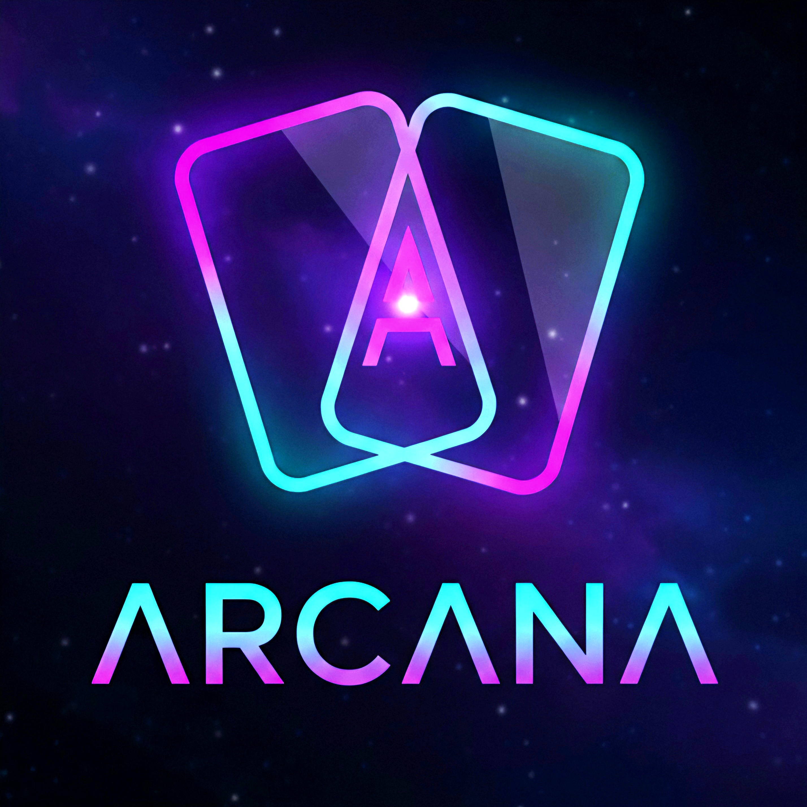

# Language
[Leia em Português 🇧🇷](./README_BR.md)

  

# Your Code Library!

**Arcana** is an immersive and private environment designed for developers and Prompt Engineers looking to organize their work (snippets, logic, and prompts) with absolute security. Unlike other tools, Arcana is **100% Offline-First**, ensuring your data never leaves your device.

---

## 🌌 The Aesthetic: Mystic-Tech
The design was built on the concept of **Glassmorphism** and **Neon**, joining modern technology with the feel of an ancient spellbook.
* **Immersive Interface**: Mist effects, pulsing stars, and subtle transparencies.
* **Deck System**: Your notes are organized into modular cards with **flip** animations and fluid interaction.
* **Relaxing Interface**: The app's design was made to include people who work late into the night. The colors were chosen cautiously to not make you even more tired!

## ✨ Main Features
- 🗂️ **Tag Organization**: Filter your cards instantly by language (TS, PY, SQL) or category.
- 🔄 **Flip Animation**: View the code on the front and technical details on the back of the card.
- 🛠️ **Snippet Editor**: Professional syntax highlighting and character counter for productivity.
- 🔒 **Native Privacy**: Your data is saved locally on the device.
- 💾 **Arcane Backup**: Manual data import and export system for total security.

---
## *Access the app demo [HERE](https://arcana-ruddy.vercel.app/)! (Online version updated in real-time)*
---

## 🚀 Arcana Boost (Coming Soon)
We are working on the integration with **DML - Dense Models Language** for:
- Automatic cleaning of comments in code.
- Intelligent tag generation.
- Magic templates for complex prompts.
- Local AI for quick chat.
- Possibility to choose your own AI or use external provider APIs.

## 🛠️ Technologies Used
- **Next.js** (Framework)
- **Tailwind CSS** (Styling with a focus on Glassmorphism)
- **TypeScript** (Type safety)
- **Vercel** (Hosting)

---

## ⚖️ License
This project is under the **MIT License**. Feel free to use, modify, and expand it however you prefer.

## 💜 Credits
* **Idealization and Product Direction:** [Eduardo00082](https://github.com/Eduardo00082)
  *(Responsible for the project vision, features, final design review, and product).*

* **Visual Concept and Design (UI/UX):** Luna (AI - Gemini)
  *(Creation of the visual identity and user experience).*

* **Development and Engineering:**
  * **Claude Opus:** Logic refinement and polishing of main functions.
  * **v0.app:** Initial structure and project prototyping.
  * **GitHub Copilot:** Technical review, architecture cleanup, and optimization.

---
## 📖 About the Project
Arcana was born from the desire to create my own app, and that it could be useful for people.

Developed entirely through a hybrid setup, using a **Chromebook** for coding + **GitHub Codespaces** and a **cell phone** for real-world tests, this project is the result of an intense collaboration between human and artificial intelligence.

I believe that the role of the developer is evolving into something I never thought it could: Me, an ordinary person and technology enthusiast, who before didn't believe I could be, at least a fraction, equal to the developers who dedicate themselves to creating their apps. To me, this is art. And I value that. I'm not saying that using AI makes me part of this community of artists. Maybe I never will be. But that doesn't indicate that I also don't have human creativity just because I use AI. I also want the feeling of creating something.

In this solo project, I treat AIs as more than a tool, we are collaborative partners. In Arcana, my job was to use different LLMs (Large Language Models) to build a tool that I personally needed, and that maybe will be useful for you too. Even not knowing how to code a single line of code, I had to make small adjustments manually (even having to ask for more detailed comments. Please, forgive me for the amount of comments that just fatten the codes, lol).

* **I do it as a hobby:** I'm still in High School, without any experience in programming. But I will dedicate myself to the maximum in this project (and maybe in future projects), doing everything that is within my current reach. All I want is to create something useful. :)
